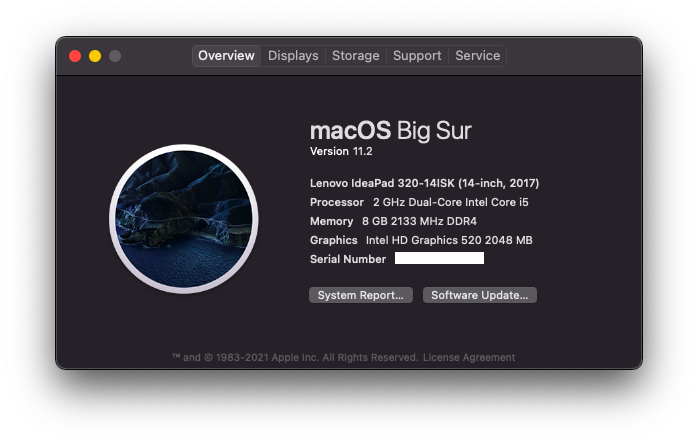

# Lenovo IdeaPad 320-14ISK (80XG) Hackintosh 

A guide for installing macOS Big Sur on Lenovo IdeaPad 320-14ISK using OpenCore UEFI hotpatch.

# Note 
This repo is originally forked from [Ab2774's Ideapad 14-IKB Repo](https://github.com/Ab2774/Lenovo-IdeaPad-320-14-IKB-Hackintosh) with some modifications and adjustments for Lenovo Ideapad 320-14ISK version. Big Thanks to him for reference and providing mostly ACPI Patch for this Laptop to make it working better and close to real-mac experience.  

# Laptop's Hardware 
- <b>CPU</b>: [Intel i3 6006U](https://ark.intel.com/content/www/id/id/ark/products/91157/intel-core-i3-6006u-processor-3m-cache-2-00-ghz.html) Dual-Core CPU 1.9Ghz (Skylake-U)
- <b>GPU</b>: Intel HD 520 Graphics 
- <b>Storage</b>: 128GB V-Gen Sata 2,5" SSD (Upgraded)
- <b>RAM</b>: 8 GB DDR4 2133MHz (Upgraded)
- <b>Screen</b>: 14-inch HD (1366 x 768)
- <b>Trackpad</b>: SYNAPTICS SYNA2B33 (I2C)
- <b>Wi-Fi</b>: Intel Wireless Dual-Band AC-3165 (Stock)
- <b>Ports</b>: 1 x USB-C, 2 x USB 3.0,USB 2.0 SD Card Reader, HDMI Display Port, Ethernet Port

# Overview 
This laptop is a budget laptop, by these specs, you can't do some heavy work, battery life is around 2-3 hours, It's good but not the best, if you want more you can choose higher specs, but consider that this guide may be different for your hardware.

# What's Working?
- Intel HD 520 Graphics full QE/CI 
- CPU power management 
- Battery w/ Lenovo Conservation Mode Working (Cycles doesn't show properly)
- All USB ports 
- HDMI port (including HDMI Audio)
- Realtek Ethernet port 
- Realtek ALC230 Audio + work after sleep(including headphones jack + line-in microphone)
- Wi-Fi & Bluetooth (with some issues caused by OpenIntelWireless kexts limitation. more information [here](https://openintelwireless.github.io/itlwm/))
- Internal webcam with Facetime
- Synaptics Trackpad with GPIO mode (full working gestures & after sleep)
- Sleep (hibernation, lid sleep, and lid wake)
- Native macOS Hibernation
- Screen Brightness with Hotkeys
- Fn keys and Hotkeys lock
- iMessage + Facetime and All Apple Services

# What's Not Working?
- Apple Pay, requires TouchID, more information [here](https://discussions.apple.com/thread/7808558)

# Bugs
- Microphone doesn't work in Chrome or Firefox (Safari works perfeclty fine), see https://github.com/Ab2774/Lenovo-IdeaPad-320-14-IKB-Hackintosh/issues/3.
- Touchpad got buggy click-stick after wake (just click once and the issue is gone)

# BIOS Configuration
Before doing anything, make sure to update your BIOS to the latest version from [here](https://pcsupport.lenovo.com/us/en/products/laptops-and-netbooks/300-series/320-14ikb/downloads/ds121587), preparing your laptop to macOS, reboot your laptop, when the Lenovo logo appears press <b>F2</b>, when the BIOS menu appears go to: 
- "Configuration" <b>SATA Controller Mode</b> to <b>AHCI</b>, <b>HotKey Mode</b> to <b>Enabled</b>.
- "Security" <b>Intel Platform Trust Technology</b> to <b>Disabled</b>, <b>Intel SGX</b> to <b>Disabled</b>, <b>Secure Boot</b> to <b>Disabled</b>.
- "Boot" <b>Boot Mode</b> to <b>UEFI</b>,<b>Fast Boot</b> to <b>Disabled</b>, <b>USB Boot</b> to <b>Enabled</b>.
- "Exit" <b>OS Optimized Defaults</b> to <b>Disabled</b>.

# Credits
- [Apple](https://www.apple.com) for macOS.
- [Acidanthera](https://github.com/acidanthera) for most of the kexts.
- [RehabMan](https://github.com/RehabMan) for some ACPI patches.
- [Steve Zheng](https://github.com/stevezhengshiqi) for some patches.
- [zhen-zen](https://github.com/zhen-zen) for YogaSMC.
- [Hiep Bao Le](https://github.com/hieplpvip) for AppleBacklightSmoother
- [Sniki](https://github.com/Sniki) for some patches.
- [daliansky](https://github.com/daliansky) for some ACPI patches.
- [Moh_Ameen](https://github.com/ameenjuz) for some ACPI patches.
- [blackosx](https://github.com/blackosx/OpenCanopyIcons) for OpenCanopyIcons theme.
- [al3xtjames](https://github.com/al3xtjames) for clover-theme-oss theme.
- [ImmersiveX](https://github.com/ImmersiveX) for clover-theme-minimal-dark theme.
- And anyone else that helped to develop and improve hackintoshing.
